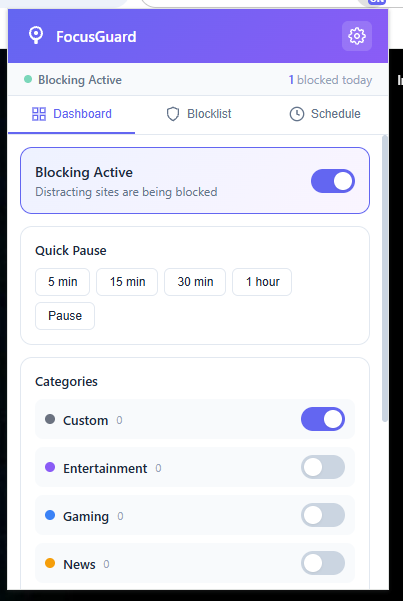

#  FocusGuard

> A lightweight, privacy-first distraction blocker for Chrome and Firefox.  
> No servers. No tracking. Everything stays on your device.

<div align="center">
  
</div>

---

## Features

| Feature | Description |
|---|---|
| **Block websites** | Add domains to your blocklist — they'll be blocked immediately |
| **Category presets** | Social media, news, entertainment, shopping & gaming with one-click presets |
| **Schedule blocking** | Set per-day time ranges; supports overnight schedules (e.g. 22:00–06:00) |
| **Quick pause** | Pause blocking for 5m, 15m, 30m, 1h, or indefinitely with live countdown |
| **Allowlist** | Domains that should never be blocked, even if on the blocklist |
| **Import blocklist** | JSON, TXT (one per line), or CSV formats |
| **Export blocklist** | JSON, TXT, or hosts file format |
| **Import hosts file** | Parse `0.0.0.0` / `127.0.0.1` entries into your blocklist |
| **Bulk operations** | Select multiple domains and delete at once |
| **Search & filter** | Quickly find domains in your blocklist |
| **Blocked counter** | See how many requests were blocked today (auto-resets daily) |
| **Full backup/restore** | Export or import all settings, schedule, and blocklist as JSON |
| **Strict mode** | Prevent disabling the blocker during active schedule hours |

---

## Quick Start

### Chrome

1. Open `chrome://extensions`
2. Enable **Developer mode** (toggle in top-right)
3. Click **Load unpacked**
4. Select the `focusguard` folder (the one with `manifest.json`)
5. The shield icon appears in your toolbar — click it to open FocusGuard

### Firefox

1. Open `about:debugging#/runtime/this-firefox`
2. Click **Load Temporary Add-on…**
3. Select `manifest-firefox.json` from the folder
4. The shield icon appears in your toolbar

> For permanent installation in Firefox, you'll need to sign the add-on via [addons.mozilla.org](https://addons.mozilla.org).

---

## Usage

### Dashboard

The main popup gives you a quick overview:

- **Main toggle** — Enable or disable all blocking
- **Quick pause** — Temporarily suspend blocking with a timer
- **Categories** — Toggle entire groups of sites on/off
- **Quick add** — Type a domain and add it immediately
- **Quick presets** — One-click add popular distraction sites

### Blocklist

All your blocked domains live here. You can:

- **Add** — Single or bulk add domains with category assignment
- **Search** — Filter domains in real-time
- **Bulk select** — Enter selection mode and delete multiple at once
- **Import** — From JSON, TXT, CSV, or hosts file
- **Export** — As JSON, TXT (one per line), or hosts file format

### Schedule

Set when blocking should be active:

- Toggle **Schedule Blocking** on/off
- Configure per-day time ranges
- Supports overnight schedules (e.g. start `22:00`, end `06:00`)
- When schedule is off, blocking is always active (if the main toggle is on)

### Options (Settings)

Click the gear icon in the popup header, or right-click the toolbar icon and select **Options**:

- **Strict mode** — Lock down the blocker during schedule hours
- **Allowlist** — Domains that bypass blocking
- **Custom categories** — Enable/disable individual categories
- **Data management** — Full export/import/reset

---

## Permissions

| Permission | Why it's needed |
|---|---|
| `declarativeNetRequest` | Block network requests to distacting domains |
| `storage` | Save your blocklist, settings, and schedule locally |
| `alarms` | Check pause expiry and schedule changes every minute |
| `tabs` | Track blocked tab navigations |
| `<all_urls>` | Apply blocking rules to any website you visit |

No data is sent anywhere. All information stays in your browser's local storage.

---

## Project Structure

```
├── manifest.json          Chrome manifest (MV3)
├── manifest-firefox.json  Firefox manifest (MV3)
├── demo.png               Preview screenshot
├── build-icons.js         Icon generator (Node.js)
├── background/
│   └── background.js      Service worker — blocking engine via DNR API
├── popup/
│   ├── popup.html         Popup UI (tabs: Dashboard, Blocklist, Schedule)
│   ├── popup.css          Styles — modern, responsive, gradient accent
│   └── popup.js           Popup logic — all UI interactions
├── options/
│   ├── options.html       Full settings page
│   ├── options.css        Settings page styles
│   └── options.js         Settings logic
├── lib/
│   └── utils.js           Shared utilities — domain parsing, schedule, presets
└── icons/
    ├── icon.svg           Source vector icon
    ├── icon-16.png
    ├── icon-32.png
    ├── icon-48.png
    └── icon-128.png
```

---

## Development

### Regenerate icons

If you modify `icons/icon.svg`, regenerate the PNG icons:

```bash
node build-icons.js
```

### Add new category presets

Edit `lib/utils.js` — the `PRESET_CATEGORIES` object and add a matching entry in `DEFAULT_SETTINGS.categories`.

---

## Privacy

**FocusGuard does not collect, transmit, or store any personal data.** There are no analytics, no telemetry, no third-party servers, and no login required. Your blocklist, schedule, and settings live entirely in `chrome.storage.local` on your own device.

---

## License

MIT
